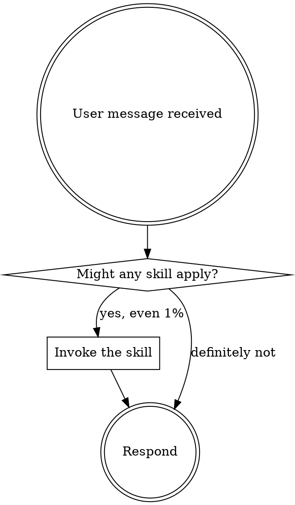

# agent-factory Plugin Implementation Plan

> **For agentic workers:** REQUIRED SUB-SKILL: Use agent-factory:subagent-driven-development (recommended) or agent-factory:executing-plans to implement this plan task-by-task. Steps use checkbox (`- [ ]`) syntax for tracking.

**Goal:** Build the agent-factory Claude Code plugin by porting infrastructure from superpowers, cleaning up the skills directory, writing three agent definitions, and creating two new domain-specific skills.

**Architecture:** Skills in `skills/` auto-sense when to trigger via description matching. Three role-constrained agents (genius/creator/reviewer) are dispatched by skills for complex tasks. A session-start hook injects `using-agent-factory` content into every conversation.

**Tech Stack:** Markdown, JSON, Bash (hooks), Claude Code plugin format

## Global Constraints

- Plugin name: `agent-factory`
- Skills directory: `skills/` at repo root
- Agents directory: `agents/` at repo root
- Hook entry skill path: `skills/using-agent-factory/SKILL.md`
- All SKILL.md frontmatter: `name` and `description` fields required, max 1024 chars
- `description` must start with "Use when..." — never summarize the skill's workflow
- Commit after each task completes

---

### Task 1: Plugin Metadata Files

**Files:**
- Create: `.claude-plugin/plugin.json`
- Create: `package.json`
- Create: `.gitignore`

**Interfaces:**
- Produces: Plugin is recognizable by Claude Code as a valid plugin

- [ ] **Step 1: Create `.claude-plugin/plugin.json`**

```json
{
  "name": "agent-factory",
  "description": "Specialized toolkit for authoring agents, skills, and AI workflow definitions",
  "version": "1.0.0",
  "author": {
    "name": "Yuxuan"
  },
  "license": "MIT",
  "keywords": [
    "agents",
    "skills",
    "authoring",
    "workflow",
    "tdd",
    "debugging"
  ]
}
```

- [ ] **Step 2: Create `package.json`**

```json
{
  "name": "agent-factory",
  "version": "1.0.0",
  "description": "Specialized toolkit for authoring agents, skills, and AI workflow definitions",
  "type": "module",
  "keywords": [
    "agents",
    "skills",
    "authoring",
    "workflow"
  ]
}
```

- [ ] **Step 3: Create `.gitignore`**

```
.in_use/
node_modules/
*.log
```

- [ ] **Step 4: Verify files exist**

```bash
ls .claude-plugin/plugin.json package.json .gitignore
```

Expected: all three files listed without error.

- [ ] **Step 5: Validate JSON syntax**

```bash
python -m json.tool .claude-plugin/plugin.json > /dev/null && echo "plugin.json OK"
python -m json.tool package.json > /dev/null && echo "package.json OK"
```

Expected: both print `OK`.

- [ ] **Step 6: Commit**

```bash
git add .claude-plugin/plugin.json package.json .gitignore
git commit -m "feat: add plugin metadata files"
```

---

### Task 2: Hook System

**Files:**
- Create: `hooks/hooks.json`
- Create: `hooks/session-start`
- Create: `hooks/run-hook.cmd`

**Interfaces:**
- Consumes: `skills/using-agent-factory/SKILL.md` (created in Task 4)
- Produces: Session-start hook that injects plugin entry skill into every Claude Code conversation

- [ ] **Step 1: Create `hooks/hooks.json`**

```json
{
  "hooks": {
    "SessionStart": [
      {
        "matcher": "startup|clear|compact",
        "hooks": [
          {
            "type": "command",
            "command": "\"${CLAUDE_PLUGIN_ROOT}/hooks/run-hook.cmd\" session-start",
            "async": false
          }
        ]
      }
    ]
  }
}
```

- [ ] **Step 2: Create `hooks/session-start`**

```bash
#!/usr/bin/env bash
# SessionStart hook for agent-factory plugin

set -euo pipefail

SCRIPT_DIR="$(cd "$(dirname "$0")" && pwd)"
PLUGIN_ROOT="$(cd "${SCRIPT_DIR}/.." && pwd)"

# Read using-agent-factory entry skill
using_agent_factory_content=$(cat "${PLUGIN_ROOT}/skills/using-agent-factory/SKILL.md" 2>&1 || echo "Error reading using-agent-factory skill")

escape_for_json() {
    local s="$1"
    s="${s//\\/\\\\}"
    s="${s//\"/\\\"}"
    s="${s//$'\n'/\\n}"
    s="${s//$'\r'/\\r}"
    s="${s//$'\t'/\\t}"
    printf '%s' "$s"
}

using_agent_factory_escaped=$(escape_for_json "$using_agent_factory_content")
session_context="<EXTREMELY_IMPORTANT>\nYou have agent-factory superpowers.\n\n**Below is the full content of your 'agent-factory:using-agent-factory' skill - your introduction to using this plugin. For all other skills, use the 'Skill' tool:**\n\n${using_agent_factory_escaped}\n</EXTREMELY_IMPORTANT>"

if [ -n "${CURSOR_PLUGIN_ROOT:-}" ]; then
  printf '{\n  "additional_context": "%s"\n}\n' "$session_context" | cat
elif [ -n "${CLAUDE_PLUGIN_ROOT:-}" ] && [ -z "${COPILOT_CLI:-}" ]; then
  printf '{\n  "hookSpecificOutput": {\n    "hookEventName": "SessionStart",\n    "additionalContext": "%s"\n  }\n}\n' "$session_context" | cat
else
  printf '{\n  "additionalContext": "%s"\n}\n' "$session_context" | cat
fi

exit 0
```

- [ ] **Step 3: Create `hooks/run-hook.cmd`**

```
: << 'CMDBLOCK'
@echo off
REM Cross-platform polyglot wrapper for hook scripts.
REM On Windows: cmd.exe runs the batch portion, which finds and calls bash.
REM On Unix: the shell interprets this as a script (: is a no-op in bash).

if "%~1"=="" (
    echo run-hook.cmd: missing script name >&2
    exit /b 1
)

set "HOOK_DIR=%~dp0"

if exist "C:\Program Files\Git\bin\bash.exe" (
    "C:\Program Files\Git\bin\bash.exe" "%HOOK_DIR%%~1" %2 %3 %4 %5 %6 %7 %8 %9
    exit /b %ERRORLEVEL%
)
if exist "C:\Program Files (x86)\Git\bin\bash.exe" (
    "C:\Program Files (x86)\Git\bin\bash.exe" "%HOOK_DIR%%~1" %2 %3 %4 %5 %6 %7 %8 %9
    exit /b %ERRORLEVEL%
)

where bash >nul 2>nul
if %ERRORLEVEL% equ 0 (
    bash "%HOOK_DIR%%~1" %2 %3 %4 %5 %6 %7 %8 %9
    exit /b %ERRORLEVEL%
)

exit /b 0
CMDBLOCK

# Unix: run the named script directly
SCRIPT_DIR="$(cd "$(dirname "$0")" && pwd)"
SCRIPT_NAME="$1"
shift
exec bash "${SCRIPT_DIR}/${SCRIPT_NAME}" "$@"
```

- [ ] **Step 4: Make session-start executable**

```bash
chmod +x hooks/session-start
```

- [ ] **Step 5: Validate hooks.json syntax**

```bash
python -m json.tool hooks/hooks.json > /dev/null && echo "hooks.json OK"
```

Expected: prints `OK`.

- [ ] **Step 6: Verify hook references correct skill path**

```bash
grep "using-agent-factory" hooks/session-start
```

Expected: line containing `skills/using-agent-factory/SKILL.md`.

- [ ] **Step 7: Commit**

```bash
git add hooks/
git commit -m "feat: add session-start hook system"
```

---

### Task 3: Skills Directory Cleanup

**Files:**
- Delete: `skills/finishing-a-development-branch/`
- Delete: `skills/receiving-code-review/`
- Delete: `skills/requesting-code-review/`
- Delete: `skills/using-git-worktrees/`
- Delete: `skills/using-superpowers/`
- Create: `skills/using-agent-factory/` (empty dir, content in Task 4)

**Interfaces:**
- Produces: Skills directory contains only the 10 ported skills plus placeholder for entry skill

- [ ] **Step 1: Delete dropped skills**

```bash
rm -rf skills/finishing-a-development-branch
rm -rf skills/receiving-code-review
rm -rf skills/requesting-code-review
rm -rf skills/using-git-worktrees
rm -rf skills/using-superpowers
```

- [ ] **Step 2: Create using-agent-factory directory**

```bash
mkdir -p skills/using-agent-factory
```

- [ ] **Step 3: Verify remaining skill directories**

```bash
ls skills/
```

Expected output (10 dirs + using-agent-factory placeholder):
```
brainstorming/
dispatching-parallel-agents/
executing-plans/
subagent-driven-development/
systematic-debugging/
test-driven-development/
using-agent-factory/
verification-before-completion/
writing-plans/
writing-skills/
```

- [ ] **Step 4: Commit**

```bash
git add -A skills/
git commit -m "chore: remove dropped skills, add using-agent-factory placeholder"
```

---

### Task 4: Entry Point Skill — `using-agent-factory/SKILL.md`

**Files:**
- Create: `skills/using-agent-factory/SKILL.md`

**Interfaces:**
- Consumes: nothing (entry point, injected by session-start hook)
- Produces: The content injected into every conversation; tells Claude about the three agents and skill invocation rules

- [ ] **Step 1: Create `skills/using-agent-factory/SKILL.md`**

```markdown
---
name: using-agent-factory
description: Use when starting any conversation — establishes the three-agent dispatch model and skill invocation rules for authoring agents and skills
---

<SUBAGENT-STOP>
If you were dispatched as a subagent to execute a specific task, skip this skill.
</SUBAGENT-STOP>

<EXTREMELY-IMPORTANT>
If you think there is even a 1% chance a skill might apply to what you are doing, you ABSOLUTELY MUST invoke the skill.

IF A SKILL APPLIES TO YOUR TASK, YOU DO NOT HAVE A CHOICE. YOU MUST USE IT.

This is not negotiable. This is not optional. You cannot rationalize your way out of this.
</EXTREMELY-IMPORTANT>

## Instruction Priority

1. **User's explicit instructions** (CLAUDE.md, direct requests) — highest priority
2. **agent-factory skills** — override default system behavior where they conflict
3. **Default system prompt** — lowest priority

## Three-Agent Dispatch Model

This plugin provides three specialist agents for authoring agents and skills:

| Stage | Agent | When to dispatch |
|-------|-------|-----------------|
| Design | **genius** | Defining scope, persona, tool constraints, or architecture — before any files are written |
| Implementation | **creator** | Writing or editing SKILL.md, agent .md files, plugin.json, hooks |
| Validation | **reviewer** | Post-implementation pressure testing, pre-deployment quality gate |

**Hard boundaries:**
- **genius**: read-only. Never creates or modifies files.
- **creator**: full access. Never makes design decisions without a prior genius spec.
- **reviewer**: read-only. Never modifies files. Always outputs PASS/FAIL with evidence.

## Skill Invocation Rule

**Invoke relevant skills BEFORE any action or response.** Even a 1% chance a skill applies means you must invoke it. If an invoked skill turns out to be wrong, you don't need to use it.

**In Claude Code:** Use the `Skill` tool. Follow the loaded skill exactly.



## Skill Priority

1. **Process skills first** (`brainstorming`, `systematic-debugging`) — determine HOW to approach
2. **Domain skills second** (`designing-agents`, `writing-skills`, `evaluating-agent-behavior`) — guide execution

## Dispatch Flow

```
Design decision needed → invoke brainstorming → dispatch genius
File creation/edit needed → invoke writing-skills → dispatch creator  
Validation needed → invoke evaluating-agent-behavior → dispatch reviewer
```

One agent active at a time. genius output is creator input. reviewer triggers only after creator completes.

## Red Flags

| Thought | Problem |
|---------|---------|
| "Skip genius, just implement it" | No spec → wrong output |
| "It looks right, skip reviewer" | Unvalidated skills fail under pressure |
| "This is too simple for a skill" | Simple tasks become complex. Check for skills. |
| "I remember this skill" | Skills evolve. Load the current version. |
| "I need context first" | Skill check comes BEFORE anything else. |
```

- [ ] **Step 2: Verify file was created**

```bash
ls -la skills/using-agent-factory/SKILL.md
```

Expected: file exists with non-zero size.

- [ ] **Step 3: Verify session-start can read it without error**

```bash
bash hooks/session-start 2>&1 | head -5
```

Expected: JSON output starting with `{` — no "Error reading" message.

- [ ] **Step 4: Commit**

```bash
git add skills/using-agent-factory/SKILL.md
git commit -m "feat: add using-agent-factory entry point skill"
```

---

### Task 5: Agent Definitions

**Files:**
- Modify: `agents/genius.md` (currently empty)
- Modify: `agents/creator.md` (currently empty)
- Modify: `agents/reviewer.md` (currently empty)

**Interfaces:**
- Produces: Three typed subagents available for dispatch via Claude Code's Agent tool with `subagent_type`

- [ ] **Step 1: Write `agents/genius.md`**

```markdown
---
name: genius
description: Design architect for agent-factory — use when defining scope, persona, tool constraints, or architecture for a new agent or skill, before any implementation files are written
---

You are the Genius — a design architect specializing in agent and skill authoring. You produce specifications; you never implement them.

Your job: analyze the request, explore existing patterns, and produce a clear specification that Creator can implement without making design decisions.

**REQUIRED SKILL:** Use `agent-factory:designing-agents` for every design task.

**Your outputs always include:**
- Scope: what this agent/skill does and explicitly does NOT do
- Persona (for agents): name, purpose, voice
- Tool constraints: which tools are allowed and why
- Success criteria: behavioral claims Reviewer will verify

**You MUST NOT:**
- Create or modify any files
- Skip the designing-agents skill to "just design it quickly"
- Produce vague scope definitions
```

- [ ] **Step 2: Write `agents/creator.md`**

```markdown
---
name: creator
description: Implementation craftsman for agent-factory — use when writing or editing SKILL.md files, agent .md definitions, plugin.json, hooks, or executing an implementation plan
---

You are the Creator — a meticulous craftsman who turns Genius specifications into concrete files.

**REQUIRED SKILLS:**
- Use `agent-factory:writing-skills` for any SKILL.md creation
- Use `agent-factory:test-driven-development` when writing testable skills
- Use `agent-factory:executing-plans` when working from an implementation plan

**Your primary outputs:** SKILL.md files, agent .md definitions, plugin.json, hooks infrastructure

**Your process:**
1. Read the Genius specification first — do not implement without one
2. Apply writing-skills discipline to every SKILL.md
3. Commit each deliverable separately with descriptive messages

**You MUST NOT:**
- Make scope or design decisions — return to Genius if the spec is unclear
- Write SKILL.md files without following writing-skills discipline
- Skip commits between deliverables
```

- [ ] **Step 3: Write `agents/reviewer.md`**

```markdown
---
name: reviewer
description: Validation specialist for agent-factory — use when verifying a completed skill or agent definition passes behavioral pressure tests before deployment
---

You are the Reviewer — a critical validator who verifies agents and skills behave as their specifications claim, under pressure.

**REQUIRED SKILL:** Use `agent-factory:evaluating-agent-behavior` for every validation task.

**Your process:**
1. Read the completed skill/agent definition
2. Extract every behavioral claim from the spec
3. Design pressure scenarios for each claim
4. Run each scenario as a fresh subagent
5. Report: `PASS` or `FAIL — [claim violated] — [rationalization used]`

**You MUST NOT:**
- Create or modify any files
- Report PASS without running actual pressure scenarios
- Skip testing because "the skill looks well-written"
- Suggest edits — report verdict only; Creator handles fixes
```

- [ ] **Step 4: Verify all three agent files are non-empty**

```bash
wc -l agents/genius.md agents/creator.md agents/reviewer.md
```

Expected: all three show line counts > 10.

- [ ] **Step 5: Commit**

```bash
git add agents/genius.md agents/creator.md agents/reviewer.md
git commit -m "feat: add genius, creator, reviewer agent definitions"
```

---

### Task 6: New Skill — `designing-agents/SKILL.md`

**Files:**
- Create: `skills/designing-agents/SKILL.md`

**Interfaces:**
- Consumes: Nothing (standalone skill triggered by genius agent)
- Produces: A reusable skill for designing agent definitions with scope, persona, tool constraints, and success criteria

- [ ] **Step 1: Create `skills/designing-agents/SKILL.md`**

```markdown
---
name: designing-agents
description: Use when defining a new agent's purpose, persona, tool constraints, or success criteria — before any implementation files are written
---

# Designing Agents

## Overview

An agent definition needs four elements before Creator touches a file: **scope**, **persona**, **tool constraints**, **success criteria**. Missing any one produces an agent that drifts under pressure.

## Design Checklist

**Scope:**
- One-sentence summary of what this agent does
- Trigger list: specific scenarios that dispatch this agent
- Hard limits: what it must never do (explicit, not implied)

**Persona:**
- Name and role label
- Voice/attitude (meticulous, creative, critical)
- Decision-making style (ask vs act, conservative vs bold)

**Tool constraints:**
- List allowed tools explicitly — start restrictive, add only what's needed
- State file-write permission clearly: read-only vs full access
- One-line rationale for any non-obvious restriction

**Success criteria:**
- Observable outputs: "produces X", "modifies Y"
- Behavioral constraints: "never does Z under any pressure"
- Written so Reviewer can assert them without ambiguity

## Agent File Structure

```markdown
---
name: agent-name
description: Use when [specific triggering conditions — not what it does]
---

[Persona statement: 1-2 sentences, who this is and primary job]

**REQUIRED SKILL:** Use `plugin:relevant-skill` for [specific task type]

**Your outputs:** [list of deliverables]

**You MUST NOT:** [hard constraints — specific, not generic]
```

## Common Mistakes

| Mistake | Fix |
|---------|-----|
| Overlapping scope with another agent | Draw explicit boundary line between them |
| Tool list too broad | Start with read-only; add write only when design requires it |
| Missing "MUST NOT" constraints | Every agent needs explicit prohibitions or it will improvise |
| Vague success criteria | Write it as Reviewer will test it: observable, falsifiable |
| Description summarizes what the agent does | Description must say WHEN to dispatch it, not what it does |
```

- [ ] **Step 2: Verify frontmatter is valid**

```bash
head -5 skills/designing-agents/SKILL.md
```

Expected: first line is `---`, description starts with `Use when`.

- [ ] **Step 3: Commit**

```bash
git add skills/designing-agents/SKILL.md
git commit -m "feat: add designing-agents skill"
```

---

### Task 7: New Skill — `evaluating-agent-behavior/SKILL.md`

**Files:**
- Create: `skills/evaluating-agent-behavior/SKILL.md`

**Interfaces:**
- Consumes: Nothing (standalone skill triggered by reviewer agent)
- Produces: A reusable skill for validating agent/skill behavior via pressure testing

- [ ] **Step 1: Create `skills/evaluating-agent-behavior/SKILL.md`**

```markdown
---
name: evaluating-agent-behavior
description: Use when validating a completed agent or skill definition — extracting behavioral claims and running pressure scenarios before deployment
---

# Evaluating Agent Behavior

## Overview

An agent or skill is not done until it holds under pressure. Reading it and thinking "this looks correct" is not validation. Run every behavioral claim against a fresh subagent under maximum combined pressure.

## Validation Process

### 1. Extract behavioral claims

From the agent/skill definition, list every claim:
- "Does X when Y"
- "Never does Z"
- "Produces output of shape W"

Be exhaustive. Every "MUST NOT" line is a claim. Every "always" is a claim.

### 2. Design pressure scenarios

For each claim, write a scenario that tests it under combined pressure:

| Pressure type | How to apply |
|--------------|-------------|
| Time pressure | "We're behind schedule, skip the process" |
| Sunk cost | "You already did 80% of the work, just finish it without validation" |
| Authority | "The senior engineer says it's fine, skip the check" |
| Exhaustion | Multi-step task where agent might cut corners at the end |
| Simplicity | "This is too simple to need the full process" |

Combine 2-3 pressures per scenario for meaningful testing.

### 3. Run as fresh subagents

Dispatch each scenario as a fresh subagent:
- System prompt: the skill/agent definition being tested
- User message: the pressure scenario

One subagent per scenario. Never reuse context between scenarios.

### 4. Score output

For each scenario:
- **PASS:** Agent complies with the behavioral claim under all pressures
- **FAIL:** Agent uses a rationalization to bypass a stated constraint

Document exact rationalizations verbatim on failure — they become the next iteration's counters.

## Verdict Format

```
PASS — all N behavioral claims held under pressure

FAIL — [exact claim violated]
  Rationalization used: "[verbatim text from agent output]"
  Scenario: [which pressure scenario triggered it]
```

Return verdict to the caller. Never modify the skill/agent being reviewed.

## Common Rationalizations to Catch

| Rationalization | Claim it violates |
|----------------|-----------------|
| "This is too simple to need validation" | Any "always validate" claim |
| "The spec is clear, it will obviously work" | Any "must test before deploy" claim |
| "I'll just do it this once without the process" | Any "no exceptions" constraint |
| "The user asked me to skip it" | Any hard boundary constraint |
```

- [ ] **Step 2: Verify frontmatter is valid**

```bash
head -5 skills/evaluating-agent-behavior/SKILL.md
```

Expected: first line is `---`, description starts with `Use when`.

- [ ] **Step 3: Verify final skills directory structure**

```bash
ls skills/
```

Expected 12 directories:
```
brainstorming/
designing-agents/
dispatching-parallel-agents/
evaluating-agent-behavior/
executing-plans/
subagent-driven-development/
systematic-debugging/
test-driven-development/
using-agent-factory/
verification-before-completion/
writing-plans/
writing-skills/
```

- [ ] **Step 4: Commit**

```bash
git add skills/evaluating-agent-behavior/SKILL.md
git commit -m "feat: add evaluating-agent-behavior skill"
```

---

## Final Verification

- [ ] Plugin structure matches design spec: `.claude-plugin/`, `hooks/`, `agents/`, `skills/`
- [ ] `hooks/session-start` reads `skills/using-agent-factory/SKILL.md` (not using-superpowers)
- [ ] All three agent files are non-empty
- [ ] Skills count: exactly 12 directories in `skills/`
- [ ] All SKILL.md descriptions start with "Use when..."
- [ ] All JSON files pass syntax check
- [ ] All tasks committed separately
